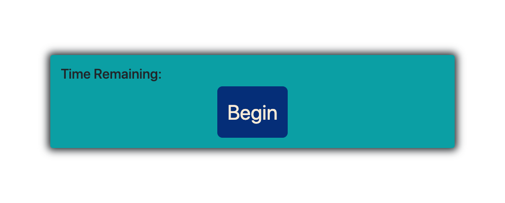
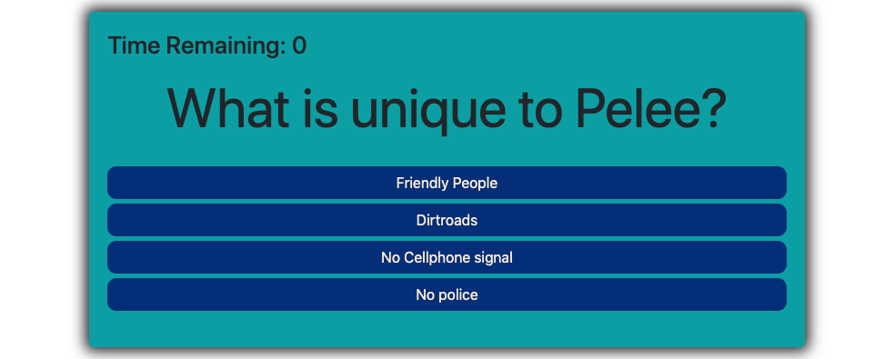
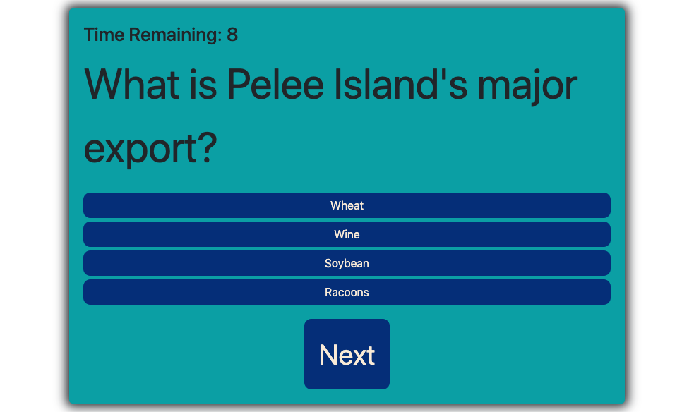

# 04_Code_Quiz

My objective for this Assignment was to create a working quiz that is timed. As the user progresses through the quiz they are met with diffrenet questions relating to a tiny Island in Canada, called Pelee Island.
I chose to do a quiz about Pelee because it is where I spent most of my childhood and it is very near to my heart. And the idea of using my new found skills to make a quiz based around Pelee is something I really enjoyed.

INSTALLATION//

1. Download or clone repository
   2.Open the index.html on your browser to view webpage
2. Use a text editor to allow for complete code viewing

INSTRUCTIONS//

1. click 'Begin' and a 50 second timer will start. Also a question will be seen on the screen.

2. when a question is shown the user will be given 4 possible answers to choose from.

3. when the user clicks on an answer a button labeled next will pop up on the screen.

4. when the user clicks on the Next button they will be given the next question. there are 5 questions in total.

5. when the timer runs out the user will be prompted to write their intials.

6. after the user writes their intials they will be given the chance to retake the quiz.(the questions have been randomized so they do not show backup in the same order)

//IMAGES

//TO DO
I still need to link the scoring system to each question. as well as figure out how to broadcast user initals and score to the webpage.
